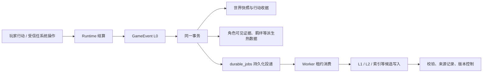

# 召回与写入：底层持久化契约

本文件定义角色、世界、记忆和后台任务共同使用的基础层。它不决定某条剧情是否重要，也不替代 CIF；它只保证：已经确认的内容不会因重启、重试或后台失败而丢失、重复或越权。

## 一、基础分工

| 层 | 保存内容 | 是否允许模型直接改写 |
| --- | --- | --- |
| L0：`objective_history` + 世界快照 | 已确认的客观事件、因果、顺序、状态版本 | 否；只能由 Runtime 结算 |
| 角色证据 | 某角色实际观察到的 L0 事实 | 否；由事件可见范围派生 |
| L1 | 单场景的情节记忆、暂时感受、公开叙事投影 | 只能生成候选，再经过校验写入 |
| L2 | 多场景形成的暂时认知、关系解释、重复目标 | 只能低频、带 L1 证据地更新 |
| L3 / CIF | 身份、价值、人格结构与版本化成长提案 | 不自动覆盖已发布 CIF |

因此，**事件日志是事实来源；记忆是有来源的角色视角投影；CIF 是受版本控制的身份模型**。三者不能互相替代。

## 二、每次行动必须满足的六项不变量

1. **完整事件信封**：每条新的 L0 都必须有 `id`、`sessionId`、`sequence`、`type`、`payload`、`causation`、`stateRevision`、`moment`、`createdAt`。不能只保存一段叙述文本；迁移前的历史事件允许缺少 `moment`。
2. **原子提交**：世界快照、事件、可见者证据、羁绊、玩家私密笔记、行动收据，以及本次派生的后台投递，必须在同一数据库事务内完成；任一项失败则整次不生效。
3. **幂等收据**：客户端的 `actionId` 是一次行动的唯一收据。同一 ID 重发或服务重启后重发，返回第一次已经持久化的 `ActionResult`，不得再次调用模型或写入事件。
4. **不可丢的投递**：耗时工作不能只靠运行时回调。事件提交时把工作写入持久化队列；后台 Worker 只负责消费，崩溃后可租约回收并重试。
5. **先授权、后召回**：角色只能检索自己可见、已解锁、在当前剧情点可用的信息。权限过滤发生在检索之前，不交给模型自行忽略秘密。
6. **可迁移、可追溯**：表结构变更有版本记录；旧事件不静默改写，纠错以新事件、失效标记和重建派生物实现。

## 三、写入流程

当前已经实现前半段：L0 事件信封、世界快照、角色证据、羁绊、私密笔记和行动收据均由 `SqliteTurnCommitter` 在一个事务中写入。重启后可根据收据还原 `ActionResult`。

## 四、持久化任务队列

统一表 `durable_jobs` 是新任务通道，字段如下：

- `kind`：任务类型，例如 `memory.l1`、`memory.l2`、`cif.l3_proposal`、`lore.embed`。
- `dedupe_key`：生产端定义的稳定逻辑键；同一任务重复投递是成功的无操作。
- `payload_json`：任务最小输入，只放 ID 和必要参数，不复制整段世界状态。
- `status`：`pending`、`processing`、`completed`、`dead`。
- `attempts`、`max_attempts`、`available_at`：退避重试与最终失败边界。
- `leased_at`、`lease_owner`：Worker 崩溃或进程重启后，过期租约可被其他 Worker 回收。

Worker 必须遵守：先原子领取，再执行模型调用，最后用同一 `workerId` 完成或重试。Worker 绝不能在模型调用前把任务标成完成。

L1 已是 `durable_jobs(kind = memory.l1)` 的第一个消费者。旧的 `memory_consolidation_tasks` 只保留为历史数据库中的兼容表，新场景不会再向它投递；之后 L2、L3、向量索引不再新建各自的轮询表。

## 五、召回流程与预算

召回不是“把所有记忆送给模型”，而是一个受控读取 API：

1. 根据角色、玩家羁绊、剧情点、可见范围和隐私先过滤。
2. L0 取当前状态、最近确认事件和本轮直接相关事实。
3. L1/L2 以参与者、地点、召回线索、时间、重要度和语义相关性排序；每层都有条数与字符预算。
4. 返回时标明 `objective`、`subjective`、`canon`、`uncertain` 来源类型和证据 ID。
5. 未命中就明确未命中；模型不得从 Lore 真相或另一角色私密记忆补全。

当前 `CharacterMemoryService` 已实现角色私有的 L1/记忆原子打分和限量返回。下一阶段将把 L0、L2、玩家私密笔记与剧情解锁规则纳入同一个读取门面，并在数据量上来后把候选检索从全表扫描换成 FTS/向量候选集。

## 六、并发、迁移和纠错边界

- SQLite 使用外键、事务和 5 秒忙等；单个世界会话的行动仍应由 Runtime 串行结算，避免不同操作基于同一旧状态并发提交。
- 游戏时间使用 `GameMoment { timelineId, tick, calendar? }`。它与现实时间分离：现实时间只用于日志与 Worker 租约；世界叙事、记忆和未来调度都以游戏 tick 为准。本阶段仅由确定性 `wait` 推进一个 tick，普通对话、移动和战斗不会隐式推进时间。
- `schema_migrations` 记录已应用结构版本。任何新增字段或重建表都必须以单独、可重复执行的迁移加入，不依赖开发者手工修改用户数据库。
- 行动收据保存请求指纹：同一 `actionId` 只有在指纹一致时才能重放；携带不同内容时必须报冲突，不能把旧结果误当作新请求的结果。早于此迁移的旧收据没有指纹，会安全地拒绝重放。
- 事件日志不删除；过期的派生记忆、向量和投影可按来源 ID 失效并重建。`dead` 任务保留错误信息，供管理端重放或人工处理。

## 七、实施顺序

1. 已完成：完整 L0 事件信封、原子 Turn Commit、重启重放、通用任务队列基础与结构版本记录。
2. 已完成：L1 投递/消费迁移为 `memory.l1`，以及普通重要对话在场景边界的候选投递。
3. 下一步：玩家故事进度写入，以及 L2 Worker、L3 提案 Worker 与发布/玩家确认链路。
4. 最后：统一 Recall Gateway、请求指纹、会话串行器、FTS/向量候选检索、归档与重建工具。
